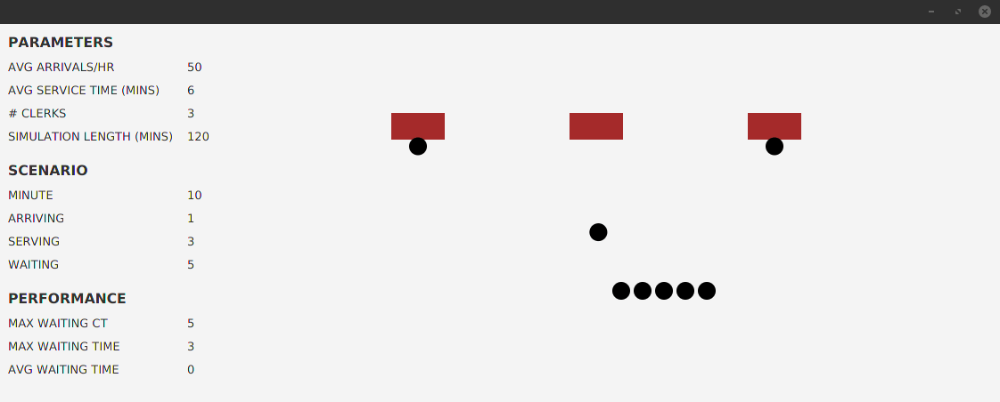

# Poisson Optimizer and Simulator

Using poisson and normal distributions to simulate staffing headcount decisions and impact on wait times. Blog post/video coming soon.

## Abstract

This is a stochastic (controlled randomness) simulator that accepts probabilistic parameters (number of staff, average customer arrivals per hour, average minutes to process a customer) and animates the outcome over a specified period.

The animation was built with JavaFX/TornadoFX. 

